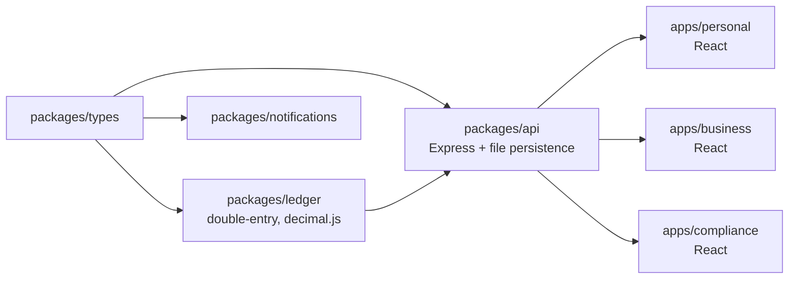

# ClearBank Monorepo

ClearBank is an open banking demo platform built as a TypeScript monorepo.  
It shares one backend across three distinct product experiences:

- Personal finance (budgets + savings goals)
- Business banking (bulk payments + FX quote desk)
- Compliance operations (KYC queue + AML alert triage)

## Architecture



## Workspaces

- `packages/types`: Shared contracts for money, ledger, KYC, AML, budgets, savings, and FX.
- `packages/ledger`: Pure TypeScript double-entry bookkeeping engine with `decimal.js`.
- `packages/api`: Domain API, validation, and file-backed persistence adapter.
- `packages/notifications`: Event notification dispatcher.
- `apps/personal`: React UI for budget and savings goal tracking.
- `apps/business`: React UI for CSV-like bulk payment upload and FX quotes.
- `apps/compliance`: React UI for KYC and AML monitoring.

## Run Locally

```bash
npm install
npm run typecheck
npm run test
```

Start everything (API + 3 UIs + package watchers):

```bash
npm run dev
```

Default local ports:

- Personal app: `http://localhost:5173`
- Business app: `http://localhost:5174`
- Compliance app: `http://localhost:5175`
- API: `http://localhost:4000`

## Demo Data Flow

Seed realistic demo records into the API persistence store:

```bash
npm run demo:seed
```

This calls `POST /demo/seed` and populates:

- personal budgets and goals
- business payment instructions
- compliance KYC reviews and AML alerts

## 5-Minute Demo Script

1. Start API only in one terminal: `npm run dev:api`
2. In another terminal, seed data: `npm run demo:seed`
3. Start the three UIs (or run full `npm run dev`):
   - `npm run dev -w @clearbank/app-personal`
   - `npm run dev -w @clearbank/app-business`
   - `npm run dev -w @clearbank/app-compliance`
4. Personal app: show budget totals + create a new goal.
5. Business app: queue a payment from CSV input and request an FX quote.
6. Compliance app: show prioritized AML alerts and pending KYC count.

## API Docs

Endpoint catalog and payload examples live in `docs/api.md`.
